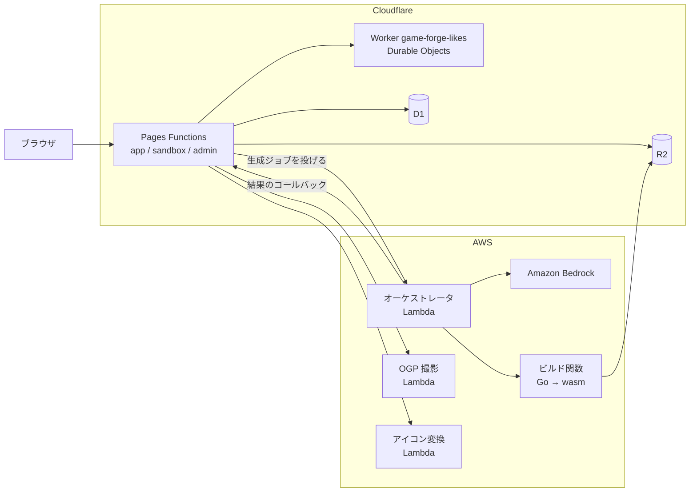

# Game Forge

プロンプト 1 行から、ブラウザで遊べる 2D ゲームを生成します。生まれた作品を他の人が改造（フォーク）して公開し合う、UGC コミュニティのリポジトリです。

- **公開形態**: 招待制のクローズドβです。プレイと URL の共有は誰でもでき、生成は招待コードを持つ人だけができます。
- **ホスト**: アプリ本体の `app.game-forge.ojos.jp`、利用者が作った作品を配信する `sandbox.game-forge.ojos.jp`、運営の管理画面の `admin.game-forge.ojos.jp` の 3 つです。

この README は入口です。仕様・手順・進み具合は下の文書が正本なので、ここへは書き写しません。

## 最初に読む文書

| 知りたいこと | 文書 |
|---|---|
| いまどこまで進んでいて、次に何をするか | [docs/handoff.md](docs/handoff.md) |
| 何を作るか（仕様と、決定の経緯） | [docs/product-spec.md](docs/product-spec.md) |
| 作業の分解（マイルストーンと issue） | [docs/mvp-roadmap.md](docs/mvp-roadmap.md) |
| 手元で動かす・検証する | [docs/local-dev.md](docs/local-dev.md) |
| AI エージェントの運用ルール | [CLAUDE.md](CLAUDE.md) → [.github/project-ai-rules.md](.github/project-ai-rules.md) → [.ai-playbook/shared-ai-rules.md](.ai-playbook/shared-ai-rules.md) |

## 仕組み

画面と API は Cloudflare Pages Functions で動きます。生成には Cloudflare の待ち時間の上限を超える時間がかかるため、生成の実行は AWS Lambda へ出しています（理由は [docs/orchestrator.md](docs/orchestrator.md) の冒頭）。作品は Go（Ebitengine）のソースとして生成し、隔離したビルド関数で WebAssembly にしてからサンドボックスのホストで配信します。



部品ごとの正本は次のとおりです。

| 部品 | コード | 宣言 | 運用の手順 |
|---|---|---|---|
| アプリ本体（3 ホスト） | [functions/](functions/)・[src/](src/) | [wrangler.toml](wrangler.toml) | [docs/pages-deploy.md](docs/pages-deploy.md)・[docs/admin-host.md](docs/admin-host.md) |
| データ（D1 / R2） | [migrations/](migrations/) | [wrangler.toml](wrangler.toml)・[terraform/r2-lifecycle.tf](terraform/r2-lifecycle.tf) | [docs/pages-deploy.md](docs/pages-deploy.md) |
| いいね・プレイ数 | [workers/likes/](workers/likes/) | [workers/likes/wrangler.toml](workers/likes/wrangler.toml) | [docs/likes.md](docs/likes.md) |
| 生成のオーケストレータ | [src/orchestrator/](src/orchestrator/) | [terraform/orchestrator.tf](terraform/orchestrator.tf) | [docs/orchestrator.md](docs/orchestrator.md) |
| LLM・費用ガード・モデレーション | [src/bedrock.ts](src/bedrock.ts)・[src/generation-models.ts](src/generation-models.ts) | [terraform/bedrock.tf](terraform/bedrock.tf)・[terraform/bedrock-guard.tf](terraform/bedrock-guard.tf)・[terraform/moderation.tf](terraform/moderation.tf) | [docs/bedrock-access.md](docs/bedrock-access.md) |
| ゲームのビルド | [docker/isolated-build/](docker/isolated-build/)・[src/build-client.ts](src/build-client.ts) | [terraform/build-function.tf](terraform/build-function.tf)・[terraform/github-oidc.tf](terraform/github-oidc.tf) | [docs/build-function.md](docs/build-function.md)・[docs/build-invocation.md](docs/build-invocation.md) |
| OGP 画像 | [docker/ogp-shot/](docker/ogp-shot/) | [terraform/ogp-function.tf](terraform/ogp-function.tf) | [docs/ogp-capture.md](docs/ogp-capture.md) |
| アイコン画像 | [lambda/avatar-encode/](lambda/avatar-encode/) | [terraform/avatar-function.tf](terraform/avatar-function.tf) | 宣言の冒頭コメント |
| Google ログイン | [src/auth/](src/auth/) | [terraform/gcp.tf](terraform/gcp.tf) | [docs/gcp-oauth-setup.md](docs/gcp-oauth-setup.md) |
| メール（Resend） | [src/mail/](src/mail/) | — | — |
| ロゴ | [tools/logobake/](tools/logobake/) | — | [docs/logo.md](docs/logo.md) |

運営が回す手順は、削除依頼の対応が [docs/takedown.md](docs/takedown.md)、集計が [docs/usage-report.md](docs/usage-report.md)、撤退条件の判定が [docs/retreat-review.md](docs/retreat-review.md) にあります。

## 手元で動かす

クラウドは本番だけで、開発は手元で完結させます。前提（Node.js 22 以上・Docker・Go・OpenSSL）は devcontainer にすべて入っています。

```bash
npm ci                            # 依存と、wrangler.toml から作る型定義（worker-configuration.d.ts）
cp .dev.vars.example .dev.vars    # アプリが読む値はここへ置く
npm run db:migrate                # migrations/ をローカルの D1 へ当てる（冪等）
npm run dev                       # https://game-forge.localtest.me:8787/
```

- **アプリが読む値は `.dev.vars` です。`.env` ではありません。** `.env` は開発ツール（`gh` など）向けで、アプリへ流れ込まないよう各 script で止めてあります。
- 証明書は初回の `npm run dev` が自己署名で作るため、ブラウザは初回に警告を出します。
- ログインを試すには、Google OAuth のクライアントと招待コードが要ります。生成の経路のうち手元では確かめられない部分もあります。どちらも [docs/local-dev.md](docs/local-dev.md) の 3 章と 5 章にあります。

## 検証

```bash
bash scripts/verify.sh       # ローカル層の受け入れ条件（機密の検査・文書の検査・テスト・型）。VERIFY_PASS で合格
bash scripts/loop-gate.sh    # push / PR 作成の前の単一入口。verify と、別ベンダーのモデルによる第二意見を直列で通す
```

`npm test`・`npm run typecheck` は単体でも回せます。実ブラウザや Docker を要する重い検査と、それぞれが何を確かめるかは [docs/local-dev.md](docs/local-dev.md) の 4 章にあります。宣言と実際の外部状態の一致は `scripts/acceptance-remote.sh` が確かめます。外部状態の宣言を変えたときに通します。

## 配備

- **アプリ本体といいねの Worker は、`main` へのマージで GitHub Actions が本番へ出します**（[.github/workflows/verify.yml](.github/workflows/verify.yml)）。検証が緑のときだけ走ります。そのコミットがもう `main` の先頭でなければ配らず、後のコミットの配備に任せます。配備済みのオーケストレータが手元の束と一致しない場合と、本番の D1 に未適用のマイグレーションがある場合は、配備の段で失敗して止まります。
- **本番の D1 へのマイグレーションの適用は、自動配備に含まれません。** 手順は [docs/pages-deploy.md](docs/pages-deploy.md) にあります。
- オーケストレータは手元から配ります（[docs/orchestrator.md](docs/orchestrator.md)）。ビルド関数のイメージは [.github/workflows/deploy-compiler.yml](.github/workflows/deploy-compiler.yml) が配ります。
- クラウドと GitHub の恒久的な状態は Terraform で宣言します（[terraform/README.md](terraform/README.md)）。state と tfvars は追跡していないので、プライマリの作業ツリーから回します。

## 開発の進め方

- 1 issue = 1 PR です。コミットメッセージは Conventional Commits の接頭辞を付けた日本語で書きます。
- 並行して複数のセッションが動くため、実装は専用の worktree とブランチで行います。
- PR には GitHub Copilot のコードレビューが 1 回かかり（[copilot-review.yml](.github/workflows/copilot-review.yml)）、かかったことを [review-gate.yml](.github/workflows/review-gate.yml) が確かめます。コミットの作者は [identity-guard.yml](.github/workflows/identity-guard.yml) が許可リストと照合します。
- 詳しい規約（intake、レビュー、機密と生成物の扱い）は [.github/project-ai-rules.md](.github/project-ai-rules.md) と [.ai-playbook/](.ai-playbook/) にあります。
