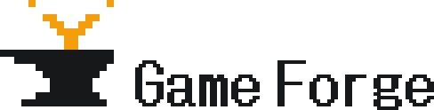

# ロゴ

**Game Forge のロゴの形・色・使い分けと、そこへ至った経緯を残す文書です（#438）。**

- 位置づけ: **由来と使い分けの説明。** 形の正本は `tools/logobake/logo.mjs`、書き出す
  ファイルの一覧の正本は `tools/logobake/variants.mjs`、書き出した PNG は `brand/logo/`
  にあります。**ファイル名とサイズの一覧はここへ書き写しません**（書き写した一覧は古くなる。
  `brand/logo/` との過不足は `node tools/logobake/main.mjs --check` が見ます）。
- 決めた日: 2026-09-13。検討に使った Claude Design のキャンバス:
  https://claude.ai/code/artifact/60476e2b-0e71-44bd-89d8-afaed911c2f4

---

## 1. 形



**シンボルとワードマークの 2 つでできています。どちらもドットの格子で、PNG はその整数倍で
描きます**——どの大きさでも輪郭がぼやけません。

### 1.1 シンボル（16×16 マス）

- **金床**（左にホーン）: 作る場所、つまり Game Forge そのもの。
- **火花**: 金床から立ち上がり、**途中で 2 本に枝分かれ**して、先に火の粉を 2 つ持ちます。
  **枝分かれは改造（フォーク）の系統を表します**——このサービスの差別化は系統を評価軸に
  据えることにある（仕様書 1 章）ためです。

**16×16 にしてあるのは、16px のファビコンで 1 マスがちょうど 1px になるから**です。
小さい大きさ用の別の形を持ちません（持つと、大きさによってロゴが違う物になります）。

### 1.2 ワードマーク

**「Game Forge」は、ゲームに組み込んでいるドット書体のグリフそのものです。** 生成された
ゲームが文字を描く `jpfont`（DotGothic16 を 16×16 に焼いたもの。#285）を、
`tools/logobake/glyphs.mjs` が `glyphs_gen.go` から直接読みます。**Web フォントの
DotGothic16 で似せたものではありません**——ゲームの画面に出る文字と 1 ドット単位で同じです。

ロゴでは 2 か所だけ手を加えています。

- **横に 1 ドット太らせる。** 書体の線は 1 ドット幅で、シンボルの太いドットと並べると
  細すぎました（2 案を並べて比べ、太らせたほうを採りました）。**1 文字ごとに幅を 1 列
  足してから太らせる**ので、字間は元のまま残ります。
- **語間を 8 ドットから 4 ドットへ詰める。** 空白のグリフのままでは開きすぎました。

---

## 2. 色

| 役割 | 色 |
|---|---|
| 墨（明るい地に置くとき） | `#16181A` |
| 墨（暗い地に置くとき） | `#E7E9EB` |
| アンバー（火花。地に関係なく同じ） | `#F59E0B` |
| 地（白） | `#FFFFFF` |
| 地（黒） | `#131517` |

**墨と地の 4 色は、サイトの画面の色（`public/assets/app.css` の `--gf-ink` と
`--gf-ground` の明暗）と同じ値です。** アンバーだけがサイトに無い色です。

**赤を避けたのは、サイトで赤がエラー表示の専用色だから**です（`--gf-danger`）。
ロゴに赤を使うと、警告の色と紛れます。

---

## 3. 使い分け

`brand/logo/` の下は種類ごとのディレクトリに分かれています。

| ディレクトリ | 何か | 使う場面 |
|---|---|---|
| `symbol/` | シンボルだけ（透過） | ファビコン、SNS の小さいアイコン、資料の隅 |
| `app-icon/` | 地を塗った正方形のシンボル | ホーム画面のアイコン（iOS / Android）。**角は丸めていません**（丸めは OS の側が行います） |
| `lockup-horizontal/` | シンボル＋文字の横組み（透過） | ヘッダ、資料の表紙、横に長い場所 |
| `lockup-stacked/` | シンボルの下に文字を置いた縦組み（透過） | 正方形に近い場所、スライドの中央 |
| `wordmark/` | 文字だけ（透過） | シンボルが別の場所に既にあるとき |
| `social/` | OGP（1200×630）とプロフィール画像（正方形） | SNS での共有、アカウントのアイコン |

**ファイル名の決まり:**

- 透過の画像は、**置く地の明るさ**で `for-light-bg` / `for-dark-bg` が付きます
  （違うのは墨の色だけです）。**暗い地に `for-light-bg` を置くと、金床と文字が消えます。**
- 地を塗った画像は、**その地色**で `white` / `black` が付きます。
- `x2` は 1 ドットを 2px で描いたもの、`512` や `1200x630` は画像の寸法です。

**拡大・縮小するときは整数倍だけにしてください。** 1.5 倍などで補間すると、ドットの輪郭が
ぼやけます。必要な大きさが無ければ、`tools/logobake/variants.mjs` に足して書き出し直します
（4 章）。

---

## 4. 書き出し直す

```bash
node tools/logobake/main.mjs            # brand/logo/ へ書き出す（一覧に無い PNG は消す）
node tools/logobake/main.mjs --check    # 一覧と brand/logo/ の画素を照合する
```

- **依存パッケージは要りません**（`node:zlib` だけで PNG を書きます）。
- **スクリプトと PNG を両方コミットします。** `tools/fontbake` と `glyphs_gen.go` の関係と
  同じです。PNG が無いと別の worktree や端末でロゴを使えず、スクリプトが無いと作り直せません。
- **`scripts/acceptance.sh` が `--check` とテストを回します。** 形や一覧を変えて書き出し
  忘れたとき、また `tools/fontbake` がグリフを焼き直したのにロゴの文字が古いままのときに
  落ちます。
- **照合はバイトではなく画素で行います。** zlib は版によって同じ入力から別のバイト列を
  出しうるので、バイト一致を合否にすると Node を上げただけで落ちます。

---

## 5. 書体のライセンス

DotGothic16 は **SIL Open Font License 1.1** です（著作権表示と全文は
`third_party/dotgothic16/`）。**Reserved Font Name の指定はありません**。

`third_party/dotgothic16/NOTICE.md` が著作権表示とライセンス全文の同梱を求めているのは、
**焼いたビットマップを書体として組み込んだ配布物**（`glyphs_gen.go`、隔離ビルドのイメージ、
ゲームの wasm）です。ロゴの PNG は書体として使える形ではなく、書体で描いた画像なので、
これと同じ扱いになるとは限りません。**ただし、ここで要否を断定しません**（これは法的助言
ではありません）。**安全側に倒し、ロゴを配布するときは表示を添えます。**

- `brand/logo/` の PNG をまとめて渡すとき（プレスキットなど）は、
  `third_party/dotgothic16/` の 2 ファイルを同梱する。
- 画像を 1 枚だけ使う場面（SNS のアイコンなど）で同梱できないときは、表示できる場所に
  「ロゴの文字: DotGothic16（Copyright 2020 The DotGothic16 Project Authors、
  SIL Open Font License 1.1）」と書く。

---

## 6. 由来

### 6.1 Canva で作るためのプロンプト

最初は Canva の画像生成で作る予定でした。プロンプトを書く前に、リポジトリから次を読んで
前提にしました。

- サービスの中身: プロンプト 1 行で生まれるブラウザ 2D ゲームと、フォーク型 UGC
  コミュニティ。**差別化は系統を評価軸に据えること**（仕様書 1 章）。
- 画面の色: ほぼ無彩色で「作品が主役」。**赤はエラー表示の専用色**（`app.css`）。
- 明暗の両テーマに対応している。**ロゴは明るい地でも暗い地でも読める必要がある。**

最初に用意したプロンプトは次の 4 つです（画像生成は英語のほうが意図が通りやすいため、
日本語版は予備です）。**生成に使ったのはメイン案で**、2 回目のプロンプトは 6.2 にあります。

**メイン案（シンボル＋文字）**

```
Minimalist flat vector logo for "Game Forge", a web platform where anyone creates 2D browser games from a single text prompt and remixes other people's games.

Symbol: a simple anvil silhouette built from chunky pixel-art squares, with a single bright spark rising from it. The spark splits into two small branches, suggesting a fork / remix lineage.

Wordmark: "Game Forge" in a bold, geometric sans-serif, clean and highly legible, placed to the right of the symbol.

Colors: charcoal (#16181A) for the anvil and text, one accent color of warm amber orange (#F59E0B) for the spark only. No red.

Style: flat, 2 colors, no gradients, no 3D, no shadows, no texture, no mascot. Strong silhouette that stays recognizable at 16px favicon size. Plain white background, centered, generous padding.
```

**別案（系統を前面に出す）**

```
Minimalist flat vector logo mark for "Game Forge". A pixel-art hammer whose head is formed by a branching tree of connected square nodes, like a git fork diagram, representing games being forged and remixed.

Monochrome charcoal (#16181A) with a single amber (#F59E0B) node highlighted. Geometric, pixel-grid aligned, no gradients, no shadows, no text inside the mark. Works as an app icon inside a rounded square. White background.
```

**文字だけのロゴ**

```
Wordmark logo reading "GAME FORGE". Bold geometric sans-serif with subtle pixel-style cuts on the letter corners. The counter of the letter "O" in FORGE replaced by a small glowing ember square in amber (#F59E0B). Everything else charcoal (#16181A). Flat vector, no gradients, no effects, white background.
```

**日本語版**

```
「Game Forge」のミニマルなフラットベクターロゴ。プロンプト 1 行で 2D ブラウザゲームを作り、他人の作品を改造できるサービス。
シンボルはピクセルアート風の四角で組んだ金床で、そこから火花が 1 つ立ち上り、途中で 2 本に枝分かれする（改造の系統を表す）。
文字「Game Forge」は太めの幾何学的なサンセリフ体でシンボルの右に置く。
色はチャコール（#16181A）と、火花だけにアンバー（#F59E0B）の 2 色。赤は使わない。
グラデーション・立体・影・質感・キャラクターは入れない。16px のファビコンでも形がわかる太いシルエット。白背景で中央に配置し、余白を広く取る。
```

### 6.2 最初の生成画像への指摘

メイン案から、ピクセルの金床と Y 字の橙の火花、面取りした太い文字の画像が出ました。
方向（2 色・ピクセル・枝分かれ）は採り、次の 5 点を直すことにしました。

1. **金床が金床に見えにくい。** 左右対称で、台座・トロフィー・盃にも見える。上の橙と
   合わせると「鉢から出た芽」にも読める。**金床らしさを決めるのは片側のホーン。**
2. **橙が火花ではなく「Y」に見える。** 枝の先に火の粉を散らすと「打って生まれた」感じが出る。
3. **ピクセルの大きさが揃っていない**（段の高さが段ごとに違う。生成画像によくある崩れ）。
4. **色が指定からずれている**（橙が #FF9100 前後、黒どうしも不一致）。
5. **余白が大きすぎる。**

直すために用意した 2 回目のプロンプトは次のとおりです（**これで生成し直す前に、6.3 の
Claude Design へ移りました**）。

```
Flat vector logo for "Game Forge". Pixel-art anvil seen from the side with a clearly pointed horn extending to the left, built on a strict square pixel grid with equal-size pixels. From the anvil face rises an amber (#F59E0B) pixel spark that splits into two branches (Y shape), with 2-3 small loose ember pixels scattered around the branch tips. Anvil in charcoal (#16181A). Two colors only, no gradients, no shadows, no anti-aliasing. Symbol only, no text, white background, tightly framed.
```

### 6.3 Claude Design で作り直した

**画像生成を重ねる代わりに、Claude Design のキャンバスでドットを 1 つずつ置いて作りました。**
画像生成は 3 の「ピクセルの大きさが揃わない」と文字の綴り崩れを避けられず、最後は
どのみち組み直しが要るためです。

キャンバスで決めたこと:

- **16×16 マスで組む**（1.1）。16px のファビコン用に細い版を別に作らない。
- **金床の胴を厚くし、ホーンを左に出す。** 最初の版は胴がくびれすぎて「工」の字に見えた。
- **火花を 2 マス幅にする。** 1 マス幅の斜めの段は、並べると点線のようにまばらに見えた。
- **文字はゲームのドット書体にする**（利用者の指定）。キャンバスでは最初、角を面取りした
  Web フォント（Chakra Petch）で組んでいたのを差し替えた。

見送った案と理由:

| 案 | 見送った理由 |
|---|---|
| 書体をそのまま（1 ドット幅）使う | シンボルに対して細すぎる。**ワードマークの比較用として残した**だけで、書き出しには含めない |
| 大文字の「GAME FORGE」を太らせる | 太らせると「M」の内側の隙間が埋まって潰れる |
| 金床と文字を同じマス目で組む（シンボルを 1 倍） | 文字に対してシンボルが小さく、主役が文字になる |
| 火花の代わりに系統樹を立てる | 枝の形が三叉の矛やサボテンに見え、1 本の火花より意味が伝わりにくい |
| 1 色版 | 今回は不要（書き出しの範囲外。#438 の scope.out） |

---

## 7. サイトにはまだ入れていない

**ファビコン・ヘッダ・OGP の既定画像への組み込みは、この文書の範囲外です（#438 の scope.out）。**
#433 が「色は無彩色を維持する（例外はエラーの赤だけ）」と決めており、アンバーの火花と
ぶつかるためです。組み込むときは、アンバーをサイトで例外として認めるか、サイトでは 1 色の
シンボルを使うかを、別に決めます。
